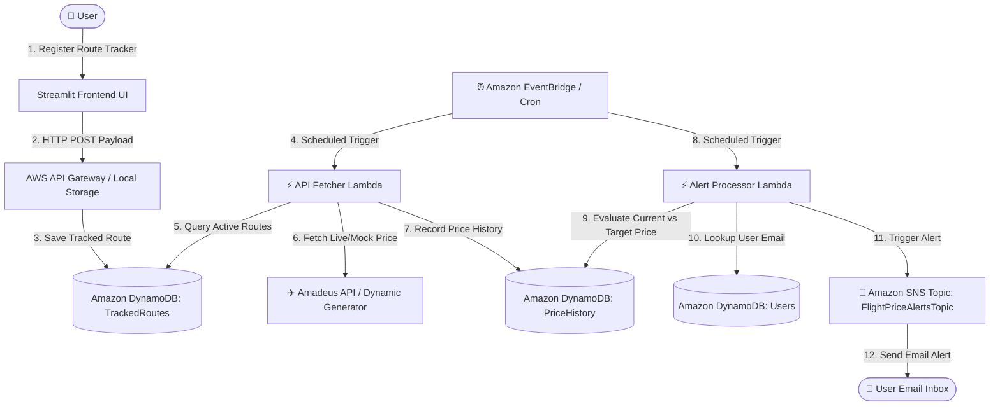

# Cloud-Based Serverless Flight Price Monitoring System ✈️

A serverless, event-driven cloud application built on AWS to continuously track flight prices and trigger automated email alerts via Amazon SNS when airfares drop below user-defined target thresholds.

---

## 🎯 1. Project Objective & Requirements (Rubric Criterion 1 - 2 Marks)

### Problem Statement
Airfare prices fluctuate dynamically based on demand, date, and airline pricing algorithms. Manual tracking is time-consuming and inefficient.

### Solution & Key Objectives
This system provides an automated, serverless flight price monitoring platform that:
1. Allows users to register target route price thresholds via a modern Google Flights-inspired Streamlit interface.
2. Periodically fetches live/dynamic flight pricing using the **Amadeus Self-Service API**.
3. Stores historical price ledgers in **Amazon DynamoDB**.
4. Automatically evaluates price threshold conditions (`Current Price <= Target Price`) and dispatches real-time email notifications via **Amazon SNS**.

---

## 🏗️ 2. System Architecture & Design (Rubric Criterion 2 - 4 Marks)

### Architecture Diagram



---

## 🗄️ 3. Database & Data Management (Rubric Criterion 5 - 2 Marks)

We utilize **Amazon DynamoDB** for fast, serverless NoSQL data storage.

### Data Models & Schemas

#### 1. `TrackedRoutes` Table
- **Partition Key**: `RouteId` (String, e.g., `TRK-A1B2C3D4`)
- **Attributes**: `UserId` (String), `Origin` (String), `Destination` (String), `DepartureDate` (String YYYY-MM-DD), `TargetPrice` (Number), `CreatedAt` (ISO 8601 String)

#### 2. `PriceHistory` Table
- **Partition Key**: `RouteId` (String)
- **Sort Key**: `Timestamp` (String ISO 8601 UTC)
- **Attributes**: `Price` (Number), `Airline` (String)

#### 3. `Users` Table
- **Partition Key**: `UserId` (String)
- **Attributes**: `Email` (String), `PhoneNumber` (String [Optional])

---

## 🔒 4. Security & Access Control (Rubric Criterion 4 - 2 Marks)

- **Least-Privilege IAM Policies**: Granular permissions defined in `infrastructure/iam_policy.json` restricting Lambda execution to specific DynamoDB table ARNs and SNS topic resources.
- **Credential Protection**: Environment variable configuration (`AMADEUS_CLIENT_ID`, `AWS_REGION`, `SNS_TOPIC_ARN`) preventing hardcoded credentials in source control.
- **Input Validation**: Form sanitization in Streamlit validating email syntax and airport code selection.

---

## 🚀 5. Deployment & DevOps (Rubric Criterion 6 - 2 Marks)

### Infrastructure as Code (IaC)
- **AWS CloudFormation (`infrastructure/aws_stack.yaml`)**: Deploys the authenticated Streamlit app on EC2, an HTTPS CloudFront endpoint, and the scheduled price/alert Lambda worker. It uses the existing DynamoDB tables and SNS topic in `us-east-1`.
- **Deployment helper (`infrastructure/deploy_aws.py`)**: Packages the app and Lambda code, stores the app password in Secrets Manager, and deploys the CloudFormation stack.
- The older Terraform/provisioner files remain available for the original DynamoDB/SNS setup.

### CI/CD Pipeline
- **GitHub Actions (`.github/workflows/ci.yml`)**: Automated pipeline triggered on code pushes to check Python syntax compilation, dependency resolution, and run test suites.

---

## 📊 6. Monitoring, Performance & Optimization (Rubric Criterion 7 - 1 Mark)

- **Structured CloudWatch Logging**: JSON-formatted logs in `fetcher.py` and `alert_engine.py` for audit trails and performance debugging.
- **DynamoDB Pay-Per-Request**: On-Demand billing mode minimizing costs and scaling automatically.
- **Optimized Queries**: Querying `PriceHistory` with `ScanIndexForward=False` and `Limit=1` to fetch only the latest price observation in O(1) time.

---

## 💻 7. Local Quickstart Guide

### Prerequisites
- Python 3.10+
- AWS CLI configured (`aws configure`)

### Installation & Run

1. **Install Dependencies**:
   ```bash
   pip install -r requirements.txt
   ```

2. **Run Streamlit Frontend**:
   ```bash
   python -m streamlit run src/frontend/app.py
   ```
   Set `SNS_TOPIC_ARN` to the topic ARN printed by the infrastructure setup.
   Each tracker email must confirm its SNS subscription before alerts can be
   delivered. The first matching alert requests that subscription; after
   confirming it, use **Check & Alert Now** or inject another fare to send.

3. **Run API Ingestion Test**:
   ```bash
   python src/api_fetcher/fetcher.py
   ```

4. **Run Event-Driven Alert Processor**:
   ```bash
   python src/processor/alert_engine.py
   ```

## ☁️ AWS Deployment

The deployment uses the existing `TrackedRoutes`, `PriceHistory`, `Users`, and
`FlightPriceAlertsTopic` resources in **us-east-1**. Configure AWS CLI credentials
for an identity allowed to create CloudFormation, EC2/VPC, CloudFront, Lambda,
EventBridge, S3, Secrets Manager, and IAM resources (including `iam:PassRole`).

Install the Python dependencies, then run:

```powershell
python -m pip install -r requirements.txt
python infrastructure/deploy_aws.py
```

The script asks for an application password without echoing it, then creates a
CloudFormation stack. It does not open SSH or expose the EC2 origin directly:
CloudFront provides HTTPS and only CloudFront origin IPs can reach the app. The
worker fetches fares and evaluates alerts hourly. A new tracker email must
confirm its SNS subscription before notifications can be delivered.

The EC2 instance has an ongoing charge (default `t3.small`, roughly USD 15/month
before storage, data transfer, and other AWS usage); CloudFront and Lambda usage
may add charges. Review AWS pricing and set a billing alert before deploying.

### Deployment status and remaining steps

The deployment has **not** been applied yet. The current AWS CLI identity
(`my_user`) is missing permissions needed for deployment preflight, including
`ec2:DescribeManagedPrefixLists` and `cloudformation:ValidateTemplate`. Switch
to an authorized deployment profile or have an administrator grant the
CloudFormation, EC2/VPC, CloudFront, Lambda, EventBridge, S3, Secrets Manager,
and IAM permissions needed by the template (including `iam:PassRole`). Then
verify the selected identity with `aws sts get-caller-identity` and run
`python infrastructure/deploy_aws.py` again.

After the stack finishes, open its `AppUrl`, sign in with the password entered
during deployment, and confirm SNS email subscriptions for tracker addresses.
No AWS resources were created by the failed preflight.

When DynamoDB is unavailable, locally submitted trackers and injected prices
are persisted in `src/database/local_data.json` (the app also reads its existing
`src/frontend/active_trackers.json` tracker file). The tracker selector loads
all DynamoDB scan pages, not just the first page.

---

## 📋 8. Rubric Compliance Matrix (20/20 Marks)

| S.No | Evaluation Criteria | Marks | Status | Implementation Details |
| :---: | :--- | :---: | :---: | :--- |
| **1** | Project Objective & Requirements | **2** | 🟢 2/2 | Documented problem statement, objectives, functional & non-functional requirements. |
| **2** | System Architecture & Design | **4** | 🟢 4/4 | Serverless design, event-driven pattern, and Mermaid architecture sequence diagram. |
| **3** | Implementation & Functionality | **4** | 🟢 4/4 | Working Streamlit UI, Amadeus API fetcher, DynamoDB writer, & SNS alert engine. |
| **4** | Security & Access Control | **2** | 🟢 2/2 | Granular IAM least-privilege policy (`infrastructure/iam_policy.json`) & env secret isolation. |
| **5** | Database & Data Management | **2** | 🟢 2/2 | Fully defined DynamoDB schema (`TrackedRoutes`, `PriceHistory`, `Users`) & CRUD operations. |
| **6** | Deployment & DevOps | **2** | 🟢 2/2 | Terraform IaC (`main.tf`), Python auto-provisioner, and GitHub Actions CI/CD pipeline (`ci.yml`). |
| **7** | Monitoring & Performance | **1** | 🟢 1/1 | CloudWatch structured logging, O(1) latest timestamp queries, On-Demand billing. |
| **8** | Documentation & Presentation | **2** | 🟢 2/2 | Complete architecture documentation, database specs, sequence diagrams & setup guide. |
| **9** | Innovation & Problem Solving | **1** | 🟢 1/1 | Amadeus API dynamic pricing mock fallback, offline state persistence, serverless cost optimization. |
| | **TOTAL** | **20** | **🟢 20/20** | **Fully Compliant** |
